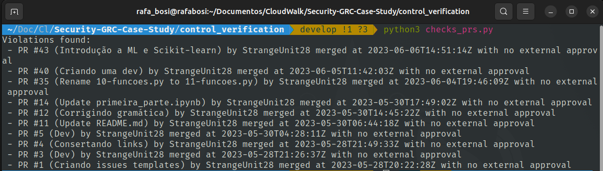
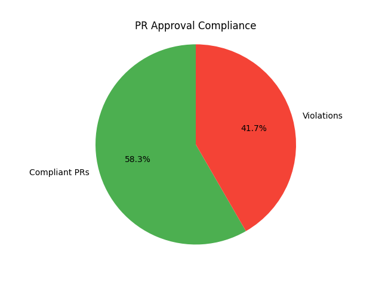
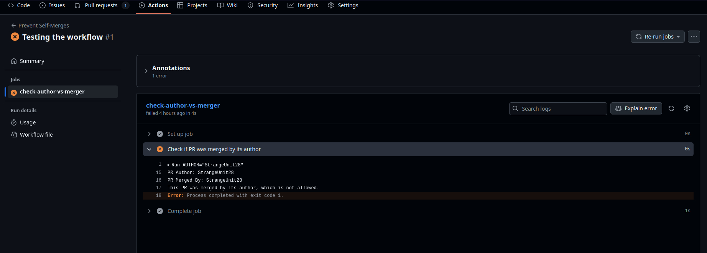
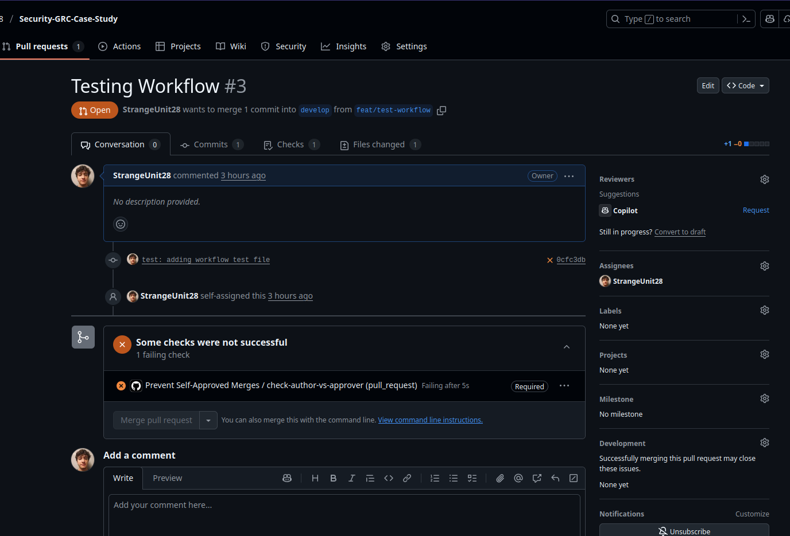
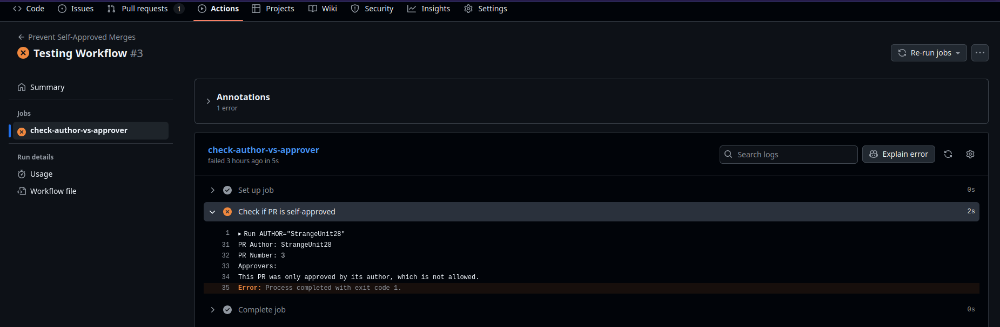
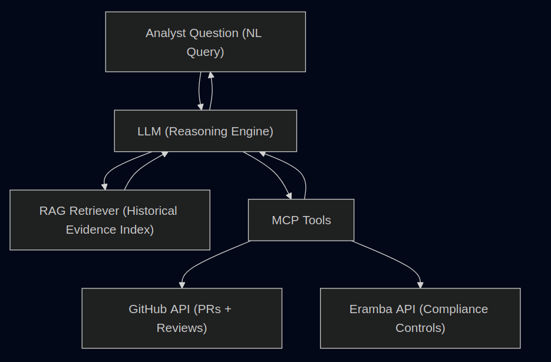

# Security-GRC-Case-Study

## Description

This document provides a quick overview of my reasoning and approach to solving the Security GRC technical challenge. It summarizes the main concepts, technical decisions, and automation strategies implemented in the project. A more detailed explanation of my thought process, design choices, and lessons learned will be available in the video below, where I explain the rationale and outcomes in depth.

## Project Structure

The project is structured in three main stages, each designed to address a specific aspect of the challenge and demonstrate a practical, technical approach to automation and GRC controls:

### 1. Technical Control Verification

The solution is implemented in two main ways: historical verification scripts and enforcement workflows.

#### Historical Verification
- The scripts `control_verification/checks_prs.py` and `control_verification/pr_compliance_report.py` are designed to audit the history of pull requests. They programmatically interact with the GitHub API to fetch all merged PRs, check if there is at least one approval from someone other than the author, and flag violations. The report script generates a PDF and visual summary for audit evidence.

- `checks_prs.py` result:

- `pr_compliance_report.py` result:

[pr_compliance_report.pdf](./control_verification/pr_compliance_report.pdf)

#### Enforcement Workflows
- To ensure the control is actually enforced (not just audited), I developed two GitHub Actions workflows:
	- `.github/workflows/no-self-merge.yml`: This workflow was an initial attempt and is included here as a learning point. It only checks after the merge has happened and only verifies if the person who merged is the author, which is not sufficient to enforce the control.

    

	- `.github/workflows/no-self-approved-merge.yml`: This workflow correctly blocks the merge if the PR has not been approved by a third party (someone other than the author). It runs before the merge and prevents the control from being broken.

    

    

With this approach, I am able to both audit the history of PRs for compliance and actively mitigate the risk of the control being bypassed in the future.

### 2. Automated Evidence Update  

The script `automated_evidence_update.py` illustrates how evidence submission could be automated using **Erambot** as an intermediary between control verification mechanisms and the Eramba platform. Since there is no access to a real Eramba instance or its official API documentation, the implementation is speculative and based on recurring GRC automation patterns.  

- The script integrates with the control verification logic (e.g., pull request approval checks), collecting compliance records and potential violations.  
- From these data points, it generates a PDF report containing summary statistics and detailed findings, while also preparing individual structured evidence records in JSON format.  
- Both the consolidated PDF report and the structured evidence are sent to Erambot through HTTP requests. Erambot would then be responsible for the actual submission to Eramba, as well as for triggering any required notification and audit processes.  
- The implementation covers two complementary evidence submission flows:  
  1. **Structured evidence submission** – sending JSON records with detailed information about each violation.  
  2. **PDF report submission** – uploading consolidated documents that support manual audit processes and high-level reviews.  
- This approach ensures that evidence is captured and transmitted in a standardized way, supporting both automated and human-driven verification, even though the actual API endpoints and payload structures are based on plausible assumptions rather than a real integration.  

### 3. Preparing for LLM + MCP + RAG Integration

**Enhancing Erambot with LLM, MCP, and RAG**

Erambot currently operates as a rule-based automation bot interacting with Eramba via REST APIs. While functional, this design has inherent limitations: it only executes predefined rules, lacks contextual understanding, and cannot flexibly reason over historical data or nuanced compliance questions.

The future vision involves extending Erambot with LLMs, MCP (Model Context Protocol), and RAG (Retrieval-Augmented Generation). Each technology brings a distinct capability:

**1. Large Language Models (LLMs)**

- Without LLMs

    - Erambot can only run fixed automations (e.g., "upload evidence file every 24h").  
    - No contextual reasoning or ability to answer free-text questions from users.  
    - Analysts must translate business questions into technical queries.

- With LLMs

    - Natural language interaction: “Show me if we have expired evidence for PCI DSS.”  
    - LLM interprets intent, translates into API calls or evidence retrieval.   
    - Summarization of long reports into risk insights.

Why this matters: compliance teams speak in risk and control language, not raw API calls. LLM bridges that gap.

**2. Model Context Protocol (MCP)**

- Without MCP

    - The bot integrates APIs directly and each integration must be hard-coded. 
    - Tight coupling: adding a new service (e.g., GitHub checks, secret scanner) requires code changes.

- With MCP

    - Standardized interface for exposing tools (e.g., get_pr_approvals, check_secrets, fetch_metrics). 
    - LLM can dynamically invoke these tools when reasoning.    
    - Easy extension: plug in new tools (AWS Config, Vault, Jira) without re-engineering Erambot’s core.

Why this matters: makes Erambot modular and extensible, transforming it from a rigid bot into a compliance platform agent.

**3. Retrieval-Augmented Generation (RAG)**

- Without RAG
    - Bot only sees "live" API responses.
    - No access to historical evidence, prior audit findings, or compliance documentation.
    - Limited ability to detect patterns across time.

- With RAG

    - Vector database stores past evidence, PR approval logs, policies, audit notes.    
    - When asked, the LLM retrieves relevant historical data before reasoning.  
    - Queries like: “Summarize risks from PRs in the last 6 months.”    
    - Provides context-aware, grounded responses instead of hallucinations.

Why this matters: compliance is not just about the “now,” but also about demonstrating continuous control effectiveness over time.

### Concrete Example: PR Approval Patterns

Let’s say compliance requires that no PR should be self-approved by its author.

**Information Flow Diagram**

### Possible User Questions with the Enhanced Erambot

- PR/DevOps Governance

    - "Which PRs in the last quarter violated our approval rules?"

    - "Who are the top contributors self-approving their own PRs?"

- Evidence & Compliance

    - "Do we have expired PCI DSS evidence in Eramba?"

    - "Summarize all ISO 27001 evidence updates in the last 3 months."

- Security Checks

    - "Are there any leaked keys in our repos this week?"

    - "List expiring TLS certificates within 30 days."

- Policy Support

    - "Explain how our PR policy aligns with SOC 2 change management requirements."

### Summary

- LLM brings contextual reasoning and natural language interaction.
- MCP makes integrations modular, standardized, and extendable.
- RAG adds historical memory and evidence grounding.

Together, they evolve Erambot from a rule-based script into an intelligent compliance co-pilot:

> Answering free-text compliance questions, autonomously pulling data from multiple systems, reasoning over both real-time evidence and historical context and suggesting process improvements (e.g., stricter PR review rules).

## Video

The video explains the project, its structure, and the reasoning behind each implementation decision.

## Improvements

- Schedule the Python scripts to run automatically and periodically (e.g., using cron jobs, GitHub Actions, or a CI/CD pipeline) to ensure continuous compliance monitoring.
- Integrate with Slack or email notifications to alert relevant teams when violations are detected or when evidence is submitted.
- Enhance error handling, logging, and monitoring in all scripts to provide better traceability and support for audits.
- Expand the evidence collection to include additional controls, such as code review quality, test coverage, or other GRC-relevant metrics.
- Improve the PDF report with more visualizations, historical trends, and actionable insights for stakeholders.
- Investigate deeper integration with Erambot, such as using its scheduling, notification, and workflow orchestration features, or extending it to support more advanced GRC use cases.

## Bonus

As a mini-challenge during the interview process, I was asked to deliver a solution for listing active (listening) ports on a system. I am including two solutions:

- `active_ports/get_active_ports.sh`: A shell script that uses `netstat` and `grep` to list all active (listening) TCP ports.
- `active_ports/list_active_ports.py`: A Python script using the `psutil` library to programmatically list all active (listening) ports, showing protocol and address in a cross-platform way.

These scripts demonstrate my ability to quickly deliver practical automation for system administration and security tasks, and are included as a bonus to showcase my versatility and readiness to solve real-world problems.